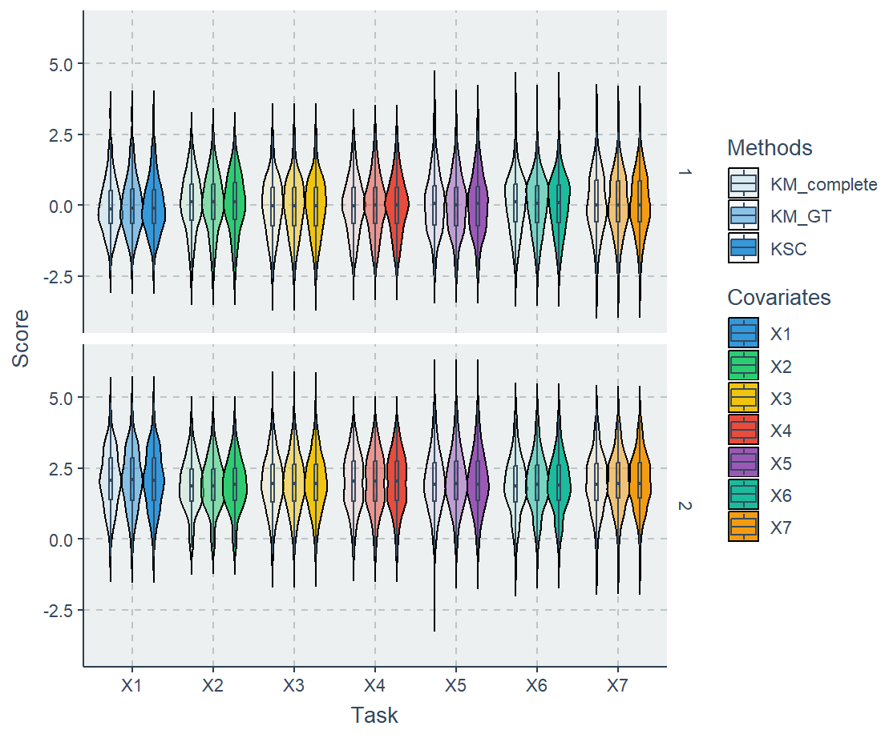

 
*The original algorithm was developed by Dr. [Kiri Wagstaff](https://www.wkiri.com/), which was published [here](https://link.springer.com/chapter/10.1007/978-3-642-17103-1_61).*
 
Wagstaff ([2004](https://link.springer.com/chapter/10.1007/978-3-642-17103-1_61)) present proposes K-means with Soft Constraints (KSC), a variant of k-means that handles missing values without imputation by using fully observed features for clustering and partially observed features to generate soft pairwise constraints. 

We simulate $n = 500$ observations and 7 random variables with two underlying clusters. The first four columns are treated as fully observed features, while the last three columns are initially generated as complete data and then randomly assigned missing values with missing rate 0.5. Before introducing missingness, standard k-means with $k=2$ is applied to all seven columns to produce a reference clustering based on the full information.

After missingness is introduced, KSC is applied using the first four complete columns for distance-based clustering and the partially observed last three columns to generate soft pairwise constraints. The resulting KSC clustering is compared against the original full-data k-means clustering using the Adjusted Rand Index introduced in ([Wagstaff's paper](https://link.springer.com/chapter/10.1007/978-3-642-17103-1_61)), with an additional comparison to ordinary k-means using only the first four complete columns. This evaluates whether KSC can recover clustering structure closer to the full-data baseline than simply discarding the incomplete features.
 

  
  <figcaption class="smaller-caption"><b>Figure 1</b>. Violin and boxplot comparison of simulated covariate score distributions across the three clustering methods: complete-data k-means, ground-truth k-means, and KSC. Scores are shown separately for the two simulated clusters, with each covariate $X_1 \sim X_7$ displayed along the x-axis; the plots illustrate that KSC largely preserves the distributional structure of the full-data clustering while using only complete covariates and soft constraints from partially missing covariates.</figcaption>

 
---
 
## Footnotes
[^1]:
